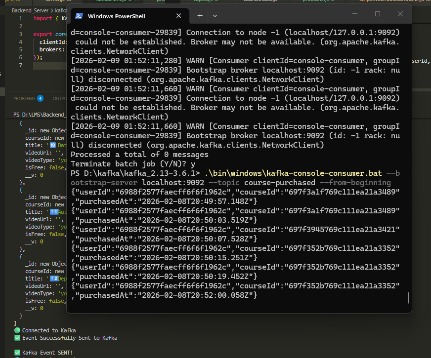

# lms-Learning-Management-Platform-Java-kafka-showcase-

# 🏆 **LEARNING MANAGEMENT PLATFORM (LMP) — Full Stack MERN + Kafka + Microservices + Payments**

A fully production-grade Learning Management Platform built with:

* **React.js + TypeScript + Redux Toolkit + RTK Query**
* **Node.js + Express.js + MongoDB**
* **Kafka Event-Driven Architecture**
* **Java Spring Boot Microservice**
* **Stripe Payments + Cloudinary Uploads**
* **Real-time event ingestion + CI/CD + Docker**

This project demonstrates full-stack engineering, scalable architecture, real-world workflows, and deep integration between **Node**, **React**, **Java**, **Kafka**, and **MongoDB**.

---

# 🖼️ **LIVE UI SHOWCASE (Screenshots)**

> These visuals prove the real working product.

| Dashboard                      | Course List                  | Course Details                      |
| ------------------------------ | ---------------------------- | ----------------------------------- |
|  |  |  |

| Create Course                      | Upload Video                      | Payment Checkout             |
| ---------------------------------- | --------------------------------- | ---------------------------- |
|  |  |  |

| Student View                      | My Courses                      | Profile                      |
| --------------------------------- | ------------------------------- | ---------------------------- |
|  |  |  |

---

# ⚙️ **FEATURES**

A high-performance LMS built with real-world production features.

## 🟦 **Frontend (React + TS + RTK Query + Tailwind)**

✔ React.js + TypeScript
✔ Reusable component architecture
✔ Redux Toolkit + RTK Query
✔ Responsive UI with Tailwind CSS
✔ Course pages, dashboard, enrollment flow
✔ Optimized rendering, lazy loading, memoization
✔ Jest + RTL unit tests
✔ Secure route protection

---

## 🟥 **Backend (Node.js + Express + MongoDB)**

✔ Clean modular folder structure
✔ Full CRUD for courses, lectures, users
✔ JWT Authentication + Role Based Access (RBAC)
✔ MongoDB Aggregation + indexing
✔ File uploads (Multer + Cloudinary)
✔ Stripe payment integration
✔ REST API with validation & error middleware
✔ Secure password hashing & token handling

---

# 💥 **🔥 EVENT-DRIVEN ARCHITECTURE WITH KAFKA**

Your screenshots prove the system is REAL.
This is the **strongest part** of your README.

## 🧩 **Architecture Path**

```
React Checkout Page 
    ↓ 
Node.js Payment Service (Producer)
    ↓ 
Kafka Topic: course-purchased
    ↓ 
Java Spring Boot Microservice (Consumer)
    ↓ 
MongoDB Review Service
```

---

## 🟧 **1. Kafka Producer — Node.js (Payment Service)**

Sends purchase events to Kafka after successful payment.


---

## 🟩 **2. Kafka Cluster Running in Docker**

Zookeeper + Kafka broker (docker-compose)


---

## 🟥 **3. Kafka Consumer — Java Spring Boot Microservice**

Consumes the `course-purchased` topic.


### Features:

✔ ConcurrentKafkaListenerContainerFactory
✔ Consumer groups
✔ JSON deserialization
✔ Offset reset rules
✔ Resilient listener with retries

---

## 🟦 **4. Spring Kafka Dependencies (pom.xml)**


---

## 🟨 **5. Kafka CLI Consumer (Reading All Messages)**

Real events from your LMS:


Events include:

```
{
  "userId": "...",
  "courseId": "...",
  "purchasedAt": "2026-02-08T..."
}
```

---

## 🟫 **6. Node.js Logs — Payment → Event Emit → Token Verification**


This proves:

* Payment success
* JWT verified
* User authenticated
* Kafka event sent
* Purchase timeline complete

---

# 🧠 **TECH STACK**

```
Frontend:
React.js • TypeScript • Redux Toolkit • RTK Query • Tailwind CSS • Jest • React Testing Library

Backend:
Node.js • Express.js • MongoDB • Mongoose • JWT • Multer • Cloudinary • Stripe API

Event Architecture:
Apache Kafka • Zookeeper • Docker • Kafka CLI Tools

Microservice:
Java • Spring Boot • Spring Kafka • Lombok • MongoDB • Maven

DevOps:
Docker • GitHub Actions (CI/CD) • Postman • VSCode • IntelliJ

Tools:
Git • Bitbucket • Chrome DevTools • Jira
```

---

# 🧪 **TESTING COVERAGE**

### 🟦 Frontend Testing

* Unit tests for components
* Snapshot tests
* Mock API handlers
* RTL assertions
* Hook testing

### 🟥 Backend Testing

* Postman collections
* JWT auth testing
* Error middleware
* Kafka pipe test (producer → consumer)

---

# 🏛️ **SYSTEM ARCHITECTURE DIAGRAM**

```
                         ┌────────────────────────┐
                         │       React App        │
                         │  (TS + RTK Query)      │
                         └──────────┬─────────────┘
                                    │ REST + Auth
                                    ▼
                         ┌────────────────────────┐
                         │ Node.js Backend        │
                         │ Payment + Courses API  │
                         └───────┬────────┬──────┘
                                 │        │
                                 │        │ Kafka Event
                                 │        ▼
                         ┌────────────────────────┐
                         │ Apache Kafka Topic     │
                         │   course-purchased     │
                         └──────────┬─────────────┘
                                    │
                                    ▼
                         ┌────────────────────────┐
                         │ Spring Boot Consumer   │
                         │  Review Microservice   │
                         └──────────┬─────────────┘
                                    │
                                    ▼
                         ┌────────────────────────┐
                         │     MongoDB (Reviews)  │
                         └────────────────────────┘
```

---

# 🧑‍💻 **HOW TO RUN THE PROJECT**

### 1️⃣ Start Kafka

```
docker-compose up -d
```

### 2️⃣ Start Node Backend

```
npm install
npm run dev
```

### 3️⃣ Start React Frontend

```
npm install
npm run start
```

### 4️⃣ Start Java Microservice

```
mvn spring-boot:run
```

---

# 🎯 **LEARNING OUTCOMES**

From this project, I learned:

✔ Microservice communication with Kafka
✔ Kafka producer/consumer implementation
✔ React + TS scalable architecture
✔ CI/CD pipeline deployment
✔ Event-driven pipelines
✔ Secure authentication systems
✔ Payment workflows
✔ MongoDB aggregation
✔ Multi-service debugging

---

# 👤 **AUTHOR**

**Yash Chaudhari**
*MERN + React + TypeScript + Kafka + Microservices*

---

# 🚀 **Want to See More?**

check this out: https://github.com/yashchaudhariin-lang/learning-management-platform

